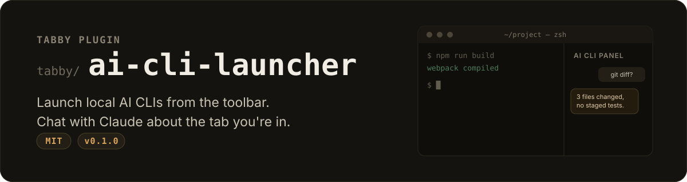
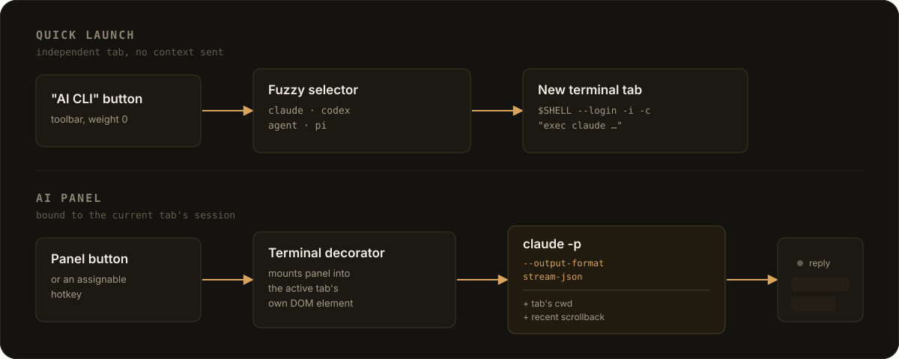

[English](./README.md) · MIT · [Tabby](https://github.com/Eugeny/tabby) 插件

## 这是什么

一个 [Tabby](https://github.com/Eugeny/tabby) 插件,包含两个相互独立的功能:一个工具栏
按钮用来在新标签页里启动本地已安装的 AI 命令行工具(Claude Code、Codex,或任何其他
命令行 Agent),另一个是停靠在**当前**终端标签页一侧的聊天面板,可以对话其中任意一个。

## 工作原理



**快速启动。** 工具栏上的"AI CLI"按钮会弹出 Tabby 内置的模糊搜索选择器(和 Profile
选择器共用同一套 UI),列出你配置的工具,选中后会在一个新的、独立的本地终端标签页里
启动——和你当时所在的标签页没有任何关联。设置页(设置 → AI CLI)可以直接增删改工具、
并一键试跑,不需要手动编辑 YAML。

**AI 辅助面板。** 第二个工具栏按钮会在你正在看的这个标签页一侧打开一个聊天面板,面板
里有个下拉框可以在 `claude`、`codex`、`agent`(Cursor Agent)、`pi` 之间切换——就是
和启动器共用的那份工具列表——旁边还有第二个下拉框选模型:`agent`/`pi` 是实际调用
`--list-models` 拿到的真实模型列表,`claude` 是它文档里写明的几个别名(它没有列表
命令),其他情况下退化成自由输入的文本框。这四个都是走各自
CLI 自带的非交互、机器可读输出模式(`claude -p --output-format stream-json`、`codex
exec --json`、`agent -p --output-format stream-json`、`pi -p --mode json`),而不是
平时交互式的那个模式——交互式的是一个完整的 TUI 程序,自己接管了整个屏幕的绘制,没
办法可靠地把它的输出改造成聊天气泡界面。每条消息都会自动带上该标签页的工作目录和最近
的滚动缓冲区文本一起发送,所以可以直接问"刚才那个报错是什么意思"而不用手动复制粘贴。
每个终端标签页都有自己独立的面板和对话。

目前只有 `claude` 的输出格式真的跑通验证过;另外三个是照着各自 CLI 的 `--help` 写的,
还没验证过——选了它们如果表现怪异是预期内的,等确认能用了再更新说明。

两个功能都会经过登录 shell(`$SHELL --login -i -c`)启动命令,这样它们能拿到和交互式
终端一致的 `PATH`——这一点很重要:Tabby 本身是从 Dock/Finder 启动的 GUI 程序,不会
继承 ~/.zshrc 等 rc 文件里通过 nvm/fnm/asdf 或包管理器设置的 `PATH`。

## 安装

还没发布到 npm——Tabby 内置插件管理器(设置 → 插件)按名字搜不到它。直接把它构建出来
放进 Tabby 的插件目录就行,这本来就是 `npm install <name>` 唯一会做的事:

```bash
cd ~/Library/Application\ Support/tabby/plugins/node_modules   # macOS
# cd ~/.config/tabby/plugins/node_modules                       # Linux
# cd %APPDATA%\tabby\plugins\node_modules                       # Windows

git clone https://github.com/HuangChenning/tabby-ai-cli-launcher.git
cd tabby-ai-cli-launcher
npm install --ignore-scripts
npm run build
```

安装后需要重启 Tabby——插件只在启动时被扫描发现。

以后要更新就跑 `git pull && npm install --ignore-scripts && npm run build`,
再重启一次 Tabby。

## 配置

打开**设置 → AI CLI**,每一行是一个工具:

| 字段 | 说明 |
|---|---|
| 显示名称 | 在工具栏选择器里显示的名字 |
| 命令 | 可执行文件名或路径,例如 `claude` |
| 参数 | 额外参数,空格分隔 |
| 工作目录 | 留空则跟随当前标签页的工作目录 |

默认包含 `claude`、`codex`、`agent`、`pi` 四项,按你机器上实际安装的工具增删/修改即可。

AI 面板还会从同一个配置命名空间(原始配置文件里的 `aiCliLauncher.chat`)读取两项设置:
`contextLines`(带多少行滚动缓冲区,默认 `50`)和 `panelWidthPercent`(面板宽度百分比,
默认 `38`)。

## 开发

把这个仓库单独 clone 到别处(不要直接放进 Tabby 的插件目录里),然后软链接过去,
这样改代码就不用每次手动拷贝了:

```bash
npm install
npm run watch   # 每次保存都会重新构建 dist/index.js
ln -s "$(pwd)" ~/Library/Application\ Support/tabby/plugins/node_modules/tabby-ai-cli-launcher
```

每次重新构建后都要重启 Tabby——插件只在启动时加载,没有热重载。

## 局限性

- 只有 `claude` 的适配器是照真实输出验证过的;`codex`、`agent`、`pi` 是照 `--help`
  猜出来的,实际用起来可能需要修(见 [CHANGELOG.md](./CHANGELOG.md))。
- 不管选哪个 CLI,都需要它本身已经登录——面板只是原样把 CLI 输出的错误(包括登录
  提示)显示出来,不会自己处理登录流程。
- 多轮对话的连续性(靠 `--resume` 续接上下文)依赖所选工具会把一个适配器认得出来的
  会话 ID 回传回来;如果它不回传,每条消息实际上就是新开一轮对话。
- 假定使用 POSIX 登录 shell(`$SHELL`、`--login -i -c`);在 Windows 上未经测试,那里
  没有这套参数组合的对应概念。
- 每个聊天气泡是按完整消息一次性填入的,不是逐字流式显示——还没接入
  `--include-partial-messages`。
- 面板对话只存在内存里。关闭标签页或重启 Tabby 都会丢失聊天记录(不过底层的 `claude`
  会话本身仍然可以通过 CLI 的 `claude --resume` 恢复)。

## 许可证

MIT
